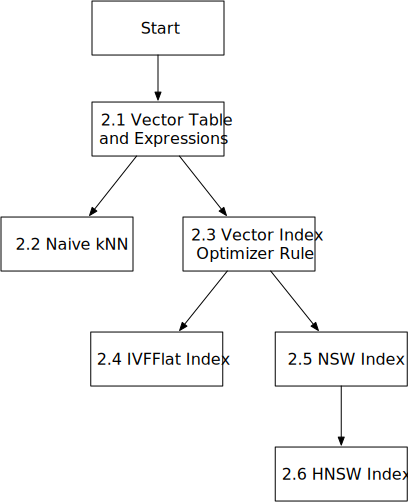

# The C++ Way (over BusTub)

In this section, we will implement a vector database extension over the BusTub educational system.

## Overview

You may approach this tutorial by implementing the things that interest you most first. The following figure is a learning path diagram that visualizes the dependencies between the chapters.



## Environment Setup

You will be working on a modified codebase based on Fall 2023's version of BusTub.

```shell
git clone https://github.com/skyzh/bustub-vectordb
```

At minimum, you will need `cmake` to configure the build system, and `llvm@14` or Apple Developer Toolchain to compile the project. The codebase also uses clang-format and clang-tidy in `llvm@14` for style checks. To compile the system,

```shell
mkdir build && cd build
cmake ..
make -j8 shell sqllogictest
```

Then, you can run `./bin/bustub-shell` to start the BusTub SQL shell.

```
./bin/bustub-shell

bustub> select array [1.0, 2.0, 3.0];
+-------------+
| __unnamed#0 |
+-------------+
| [1,2,3]     |
+-------------+
```

In BusTub, you can use the `array` keyword to create a vector. The elements in a vector must be of decimal (double) type.

## Extra Content

**What did we change from the CMU-DB's BusTub codebase**

The `bustub-vectordb` repository implements some stub code for you so that you can focus on the implementation of the vector things.

**Buffer Pool Manager**. We have a modified version of the table heap and a mock buffer pool manager. All the data stay in memory. If you are interested in persisting everything to disk, you may revert the buffer pool manager patch commit (remember to revert both the buffer pool manager and the table heap), and start from the 15-445/645 [project 1](https://15445.courses.cs.cmu.edu/fall2023/project1/) buffer pool manager.

**Vector Expressions**. The modified BusTub codebase has support for vector distance expressions.

**Vector Indexes**. The codebase adds support for vector indexes besides B+ tree and hash table indexes.

**Vector Executors**. With the vector index conversion optimizer rule and the vector index scan executor, users will be able to scan the vector index when running some specific k-nearest neighbor SQLs.

{{#include copyright.md}}
