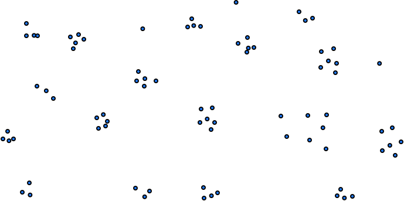
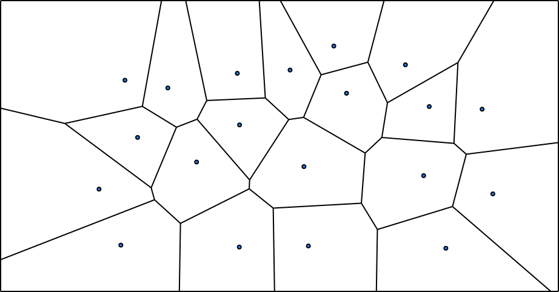
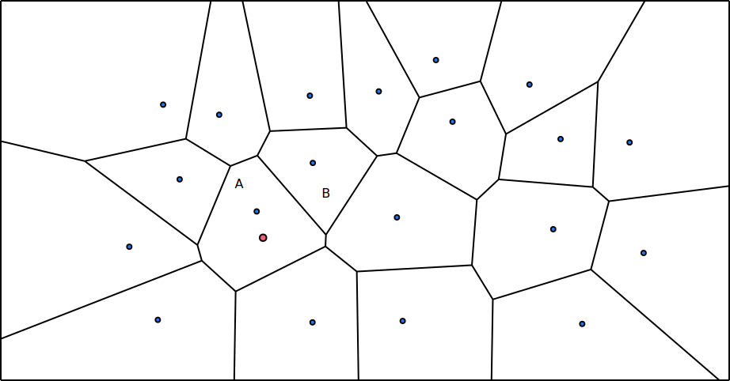
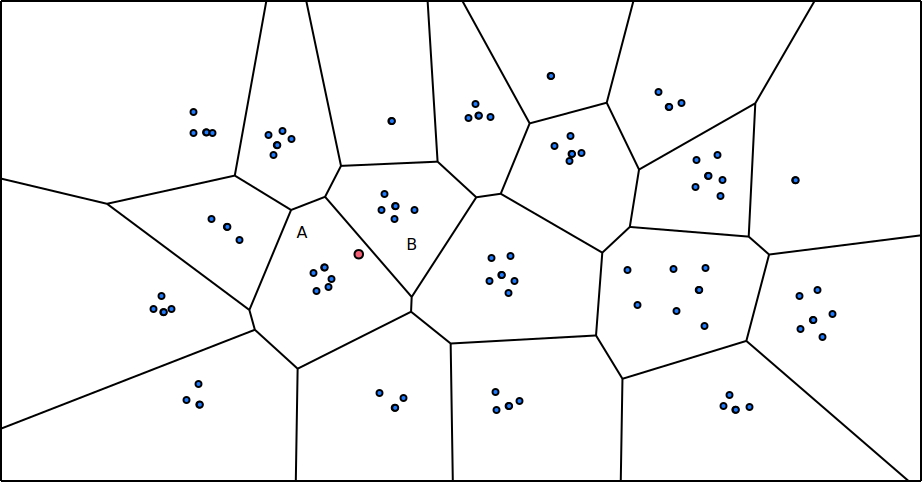

# IVFFlat (Inverted File Flat) Index

IVFFlat (InVerted File Flat) Index is a simple vector index that splits data into buckets (aka. quantization-based index) so as to accelerate vector similarities search.

The list of files that you will likely need to modify:

```
src/include/storage/index/ivfflat_index.h
src/storage/index/ivfflat_index.cpp
```

*Related Readings*

* [Product Quantization from Pinecone's Faiss Manual](https://www.pinecone.io/learn/series/faiss/product-quantization/). You may skip the product quantization part and take a look at the IVF visualization.

## Overview

The core of IVFFlat index is to build some buckets for vector data based on distances. By splitting buckets, the index can narrow down the range of data to be searched for each query, so as to accelerate vector similarity searches.

IVFFlat index search yields approximate nearest neighbors, which means that the result of the index lookup might not be 100% the same as the naive kNN implementation.

## Index Building

A naive implementation of IVFFlat index should be built upon a large amount of existing data. The user should populate the vector table and then request building an IVFFlat index. During the process, the algorithm finds `lists` number of centroids using the K-means algorithm. Then, vectors are stored within the bucket corresponding to the nearest centroid.

Assume that we have vectors in a 2-dimension space as below:



When the user requests to build an index on existing data, the algorithm first finds the centroids using the [K-means algorithm](https://en.wikipedia.org/wiki/K-means_clustering). Each centroid corresponds to a bucket, which will store a cluster of vectors. Each vertex on edge in the below [Voronoi diagram](https://en.wikipedia.org/wiki/Voronoi_diagram) has the same euclidean distance to the two nearest centroids, which implies the edge of the split buckets.



Now that we have the centroids, the algorithm can go through all vectors and put them into the corresponding bucket based on the nearest centroid to the vector.


<small>Credit: the graph is generated with [https://websvg.github.io/voronoi/](https://websvg.github.io/voronoi/) and edited with OmniGraffle.</small>

Going through the process, you will find that, in a naive implementation of IVFFlat index,

* It can only be built upon existing data. You cannot start an IVFFlat index from empty set.
* The centroids are decided at the index build time, and if the data inserted later have different distribution from the initial data, the index will become inefficient.

## Insertion

The insertion process simply finds the nearest centroid to the vector and puts the vector into that bucket.



In the above example, the red vertex will be added to the A bucket.

## Lookup

The lookup process will find the nearest `probe_lists` centroids and iterate all vectors in these buckets to find the approximate nearest k neighbors. To explain why this is necessary, let us take a look at the below example.



The red vertex is the base vector that the user wants to find, for example, its 5 nearest neighbors. If we only search the A bucket (which the red vertex should be in), we will find all 5 vertices in the A bucket. However, there might be some vertices in a nearby B bucket that has shorter distance to the base probe vector. Therefore, to increase the accuracy of the search, it would be better to probe more than one bucket for a base vector, in order to get more accurate nearest neighbors.


In the index lookup implementation, you will need to probe `probe_lists` number of centroid buckets, retrieving k nearest neighbors from each of them (we call them local result), and do a top-n sort to get the k nearest neighbors (global result) from the local result.

## Implementation

You may implement the IVFFlat index in `ivfflat_index.cpp`. Some notes:

* You may implement the K-means algorithm to run for a fixed amount of iterators (i.e., 500) instead of waiting for converging.
* You may need to store the indexed vectors along with RIDs of the data because the database system will need the RIDs to retrieve the corresponding row.
* Remember that you can use `ComputeDistance` from `vector_expressions.h` to compute the distance between two points.

And the pseudo code for a naive K-means implementation:

```
def FindCentroid(vert, centroids):
    return centroids.min(|centroid| distance(centroid, vert))

def FindCentroids(data, current_centroids):
    buckets = {}
    for vert in data:
        centroid = FindCentroid(vert, current_centroids)
        buckets[centroid].push(vert)
    new_centroids = []
    for bucket in buckets:
        new_centroids = avg(buckets[centroid])
    return new_centroids

centroids = random_sample(initial_data, num_lists)
for iter in 0..500:
    centroids = FindCentroids(initial_data, centroids)
return centroids
```

## Testing

At this point, you can run the test cases using SQLLogicTest.

```
make -j8 sqllogictest
./bin/bustub-sqllogictest ../test/sql/vector.04-ivfflat.slt --verbose
```

The test cases do not do any correctness checks and you will need to compare with the below output by yourself. Your result could be different from the reference solution because of random stuff (i.e., random seed is different). You will need to ensure all nearest neighbor queries have been converted to a vector index scan.

<details>

<summary>Reference Test Result</summary>

```
{{#include vector.04-ivfflat.slt.ref}}
```

</details>


## Bonus Tasks

**Implement the Elkan's Accelerated K-means algorithm**

pgvector uses [Elkan's Accelerated K-means](https://cdn.aaai.org/ICML/2003/ICML03-022.pdf) algorithm to make the index building process faster.

**Persist Data to Disk**

You may implement the buffer pool manager and think of ways to persist the index data to the disk.

**Rebuilding the Index**

If the later inserted data have a different distribution compared with the data during index building, you might need to rebuild the index in order to make the approximate nearest neighbor result accurate.

**Deletion and Updates**

The current implementation (and vector index interfaces) only supports insertions. You may add new interfaces to the vector index and implement updates and deletions.
