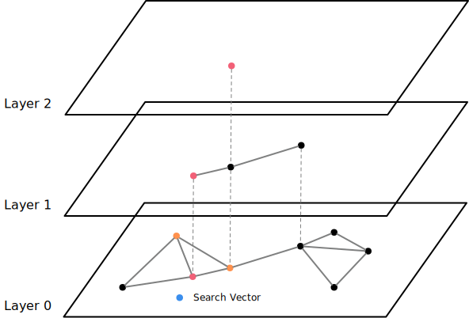

# HNSW (Hierarchical Navigable Small Worlds) Index

Now that we built NSW indexes in the previous chapter, we can now have multiple layers of NSW indexes and add hierarchy to the index structure to make it more efficient.

The starter code for this part is ready but the write-up is still working-in-progress.

The list of files that you will likely need to modify:

```
src/include/storage/index/hnsw_index.h
src/storage/index/hnsw_index.cpp
```

*Related Readings*

* [Efficient and robust approximate nearest neighbor search using Hierarchical Navigable Small World graphs](https://arxiv.org/abs/1603.09320)
* [Hierarchical Navigable Small Worlds (HNSW) from Pinecone's Faiss Manual](https://www.pinecone.io/learn/series/faiss/hnsw/)

## Overview

HNSW adds layered structure to the NSW index, therefore making the search process faster. The idea is similar to the skiplist data structure or mipmaps in computer graphics. The bottom-most level 0 NSW layer contains all information, and we randomly put some vectors to the upper layer (more upper layer has fewer elements), which are also NSW indexes. The search process starts from the upper-most layer, and uses neighbors in that layer as the entry points of the lower layer.


## Index Lookup



The algorithm starts from the upper-most layer. As above, it first searches the nearest neighbor to the search target in layer 2, then use that neighbor as the entry point to search the nearest neighbor in layer 1, and lastly, use the entry point to find the k-nearest (3-nearest) neighbors in layer 0.

**Pseudo Code**

```
ep = upper-most level entry point
for go down one level until last level:
    ep <- layers[level].search(ep=ep, limit=1, search_target)
return layers[0].search(ep=ep, limit=limit, search_target)
```

## Insertion

Before inserting, we will need to decide which layer and below levels to insert the vector. From the HNSW paper, this is computed by \\( \text{level} = \lfloor - \ln (\text{unif} (0 \ldots 1)) \times m_L \rfloor \\).


For example, we decide to add the vector to level 1 and below.


The algorihm searches the entry point to level 1 by searching the nearest neighbor starting from the upper-most layer. When it reaches level 1 and below, it searches `ef_construction` neighbors as the entry point, and selects the m-nearest neighbors from the `ef_construction` nodes to establish edges.


**Pseudo Code**

```
ep = upper-most level entry point
target_level = generate random level based on m_L
for go down one level until target_level + 1
    ep <- layers[level].search(ep=ep, limit=1, search_target)
for go down one level until level 0
    ep <- layers[level].search(ep=ep, limit=ef_construction, search_target)
    neighbors <- m-nearest neighbor in ep
    connect neighbors with search_target
    purge edges of neighbors if larger than m_max of that layer
```

You may also refer to the HNSW paper for a more detailed pseudo code.

## Implementation

You have already implemented an NSW index in the previous chapter. Therefore, you may change the HNSW index implementation to have multiple layers of NSW. In your implementation, you do not need to reuse your NSW's insertion implementation as we will need to reuse the entry points from the previous layer in the HNSW insertion process.

## Testing

At this point, you can run the test cases using SQLLogicTest.

```
make -j8 sqllogictest
./bin/bustub-sqllogictest ../test/sql/vector.05-hnsw.slt --verbose
```

The test cases do not do any correctness checks and you will need to compare with the below output by yourself. Your result could be different from the reference solution because of random stuff (i.e., random seed is different). You will need to ensure all nearest neighbor queries have been converted to a vector index scan.

<details>

<summary>Reference Test Result</summary>

```
{{#include vector.05-hnsw.slt.2.ref}}
```

</details>

{{#include copyright.md}}
